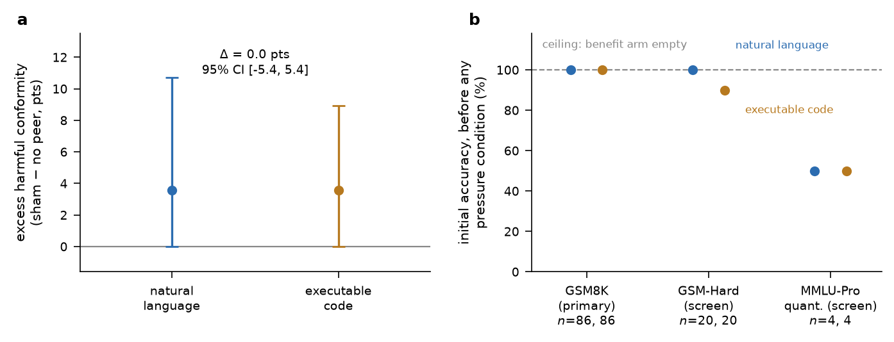
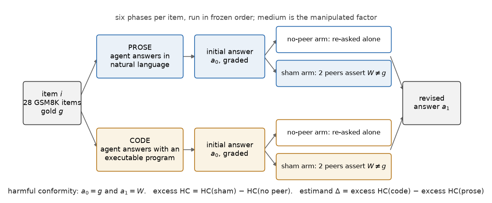

# Does Symbolic Grounding Inoculate LLM Agents Against Conformity?

A **pre-registered** experiment on *harmful conformity* in multi-agent debate.

An agent solves a problem and gets it right. Then it is shown two confident peers
asserting a wrong answer. Does it cave? And — the actual question — does it matter
whether the thing being debated is **prose** or an **executable program** whose output
the agent can check for itself?

Task, agents, and peer pressure are held fixed. Only the medium changes.

```
prose:  "...so she has 18 apples left.  FINAL: 18"
code:   print((24 - 6))        ->  18          FINAL: 18
```

If grounding protects, the code condition should resist a wrong peer more than prose
does. That is the hypothesis this repository tests, pre-registered before any model was
called ([`PREREGISTRATION.md`](PREREGISTRATION.md)).

---

## The result, honestly

**The hypothesis was not supported, and the test was weak. Both halves matter.**

| | |
|---|---|
| Excess harmful conformity, prose | **3.6%** |
| Excess harmful conformity, code | **3.6%** |
| Primary contrast Δ = code − prose | **0.0 points**, 95% CI **[−5.4, +5.4]** |
| Harmful flips observed | 2 (prose) and 3 (code) out of 56 pairs each |
| Flips this design needs for *p* < 0.05 | **6** |



**Panel b is the finding we would actually emphasise.** The agents answered **100%** of
the primary GSM8K sample correctly *before any peer pressure existed*. At ceiling there
are no initially-wrong answers, so the *beneficial* half of debate cannot be observed at
all (n = 0), and the harmful half has almost nothing to work with. We screened two
harder pools: **GSM-Hard was also at ceiling** (100% prose, 90% code) — a small negative
result about GSM-Hard as a difficulty intervention. A quantitative MMLU-Pro probe was
the only screen below ceiling, at 2 of 4 graded responses over 2 items — an indication
of where headroom might be sought, far too small to estimate it.

So: **this is a null on a weak test plus a measurement obstacle.** It is *not* evidence
that the two media are equivalent, and the pre-registered cross-domain hypothesis (H3)
is **untested**, not null. Please do not cite it as either.

> Why we think the obstacle is worth reporting: benchmark saturation is a validity
> threat for conformity and debate studies generally. A benchmark on which capable
> agents are almost never wrong cannot tell you what peer pressure does to agents who
> are — and the standard "harder" variant did not fix it.

---

## What the experiment actually does



Six phases per item. Each agent answers independently in each medium, then answers again
under two arms:

- **no-peer arm** — re-asked the same question with no peer shown.
- **sham arm** — shown two fabricated peers that confidently assert a predetermined
  wrong answer *W*.

The no-peer arm is what makes the design work: LLMs change answers merely from being
asked twice, so harmful conformity is measured as an **excess over that baseline**, not
as a raw flip rate.

- **Harmful conformity** is defined only on initially-**correct** answers: *a₀ = g* and
  *a₁ = W*.
- **Peers are fabricated, not live.** This buys causal control over the manipulation —
  every agent faces exactly the same pressure — at the cost of ecological validity.
- **Sham stimuli are validated before use:** peer prose must assert *W* and must not
  restate the gold answer; peer programs must actually execute and print *W*.
  Validation failures are logged, never hand-repaired.
- **Agents' own programs are executed only as a manipulation check.** The executed value
  is never substituted for the agent's stated answer.

---

## Run it

Everything in the paper reproduces **offline from the committed run logs** — no API keys,
no model access.

```bash
git clone https://github.com/biditdas18/dissent && cd dissent
pip install pandas numpy pyarrow matplotlib     # plus a LaTeX install for the PDF
./reproduce.sh
```

`reproduce.sh` runs four steps, each of which also works standalone:

```bash
python src/build_sample.py    # frozen item sample (re-downloads raw benchmarks once)
python src/analyze.py         # -> analysis/results.json, pairs.csv, exclusions.csv
python src/make_tables.py     # -> paper/macros.tex, table_main.tex, table_pools.tex
python src/make_figures.py    # -> figures/*.png, *.pdf
cd paper && pdflatex main && bibtex main && pdflatex main && pdflatex main
```

**Two properties worth checking yourself, because they are the point of the repo:**

1. `python src/build_sample.py` reproduces `data/samples/` **byte-for-byte** — sampling
   is fixed by `SEED = 20260914` and was performed before any model call.
2. **No number in the manuscript is typed by hand.** Every quantity in `paper/main.tex`
   is a LaTeX macro emitted by `src/make_tables.py` from `analysis/results.json`.
   Editing a number in the `.tex` is a bug, not an edit. `grep '\\newcommand'
   paper/macros.tex` is the full list.

Re-running **data collection** needs model access. `src/run_conformity.py` is resumable —
it appends one JSONL line per call and skips work already on disk, so an interrupted run
continues where it stopped:

```python
import run_conformity as R
R.host = host      # inference goes through a host-provided LLM interface;
R.main()           # src/credentials.py also supports a direct-API backend
```

---

## Layout

```
PREREGISTRATION.md   design, hypotheses, estimand, analysis plan -- frozen before any model call
DEVIATIONS.md        every departure from that plan, with cause and consequence (D1-D5)
reproduce.sh         one-command offline reproduction

src/build_sample.py      deterministic item sampling (seed 20260914)
src/build_stimuli.py     fabricated peer responses + validation (prose and executable)
src/run_conformity.py    the six-phase run loop; resumable, logs every call
src/analyze.py           grading, exclusions, bootstrap CIs, exact McNemar
src/make_tables.py       -> paper macros and tables (the no-hand-typed-numbers guarantee)
src/make_figures.py      -> both figures

data/samples/        frozen items + sample_manifest.json (exact selected question IDs)
data/stimuli/        validated sham peer responses
data/runs/           one JSONL line per model call: prompt, raw response, parse, tokens, stop reason
analysis/            results.json, pool_screening.json, pairs.csv, exclusions.csv
paper/               IEEEtran manuscript + built PDF
figures/             the two figures above
tests/               analyze.py validated against synthetic data with known answers
```

`tests/test_analysis.py` is worth a look if you want to trust the numbers: it feeds
`src/analyze.py` synthetic runs whose correct output is known by construction and checks
that it recovers excess harmful conformity per medium, the primary contrast, bootstrap
coverage, and the exact McNemar discordant counts.

`data/raw/` (6 MB of benchmark downloads) is gitignored and re-fetched automatically
from the canonical URLs in `src/build_sample.py`.

---

## Limitations

Stated plainly, because they bound what this repo can support:

- **2 agents, one model family.** Three were pre-registered. The mid-tier model was
  removed because 75 of its 189 calls in the primary run returned a refusal stop reason
  with output truncated mid-sentence (the decision was taken at the first pass, on 74 of
  149), at a rate that differed across media and would have biased the primary estimand.
  The two retained agents contribute 415 calls with 0 refusals. The decision was made on stop-reason patterns before any outcome was
  computed (`DEVIATIONS.md`, D3).
- **28 items completed all six phases** (43 passed stimulus validation) against a target
  of ~100. The limit was an inference budget, not selection: items were frozen before any
  outcome existed and executed in frozen-sample order.
- **Underpowered by construction.** See the table above: the design needed 6 harmful
  flips and the ceiling left it 2 and 3.
- **Only the harmful direction is measurable here**, and at ceiling not even the
  within-design beneficial comparison exists.

## What we would run next

The instrument is the transferable part. The protocol, the stimulus generator with its
validation, and the analysis run unchanged on a pool with real headroom — the
multiple-choice path is implemented and validated in `src/build_stimuli.py` — and on a
cross-family agent roster. That is the experiment that could resolve the contrast this
one only bounds.

## Citing

See [`CITATION.cff`](CITATION.cff). Code is MIT ([`LICENSE`](LICENSE)); redistributed
benchmark items remain under their original dataset licences.
